# Funcionalidad

Los archivos funcionan de manera que se tienen que eliminar los **//** de lo que se quiera hacer o por así decirlo, lo que se quiere ver por pantalla, se busca la manera en que la persona a cargo de programar pueda verificar método por método la correcta funcionalidad de estos mismos o por otro lado, verificar cual está dando errores, existen diferentes funciones como por ejemplo:

- imprimirDatosOrdenadosPorIDInsercion

- imprimirDatosOrdenadosPorIDBubbleSort

- imprimirDatos

- buscarPorIndice("Asignatura", "Programación 2") _(Busca por nombre de asignatura a todos los estudiantes que cursen esa clase)_

- buscarPorIndice("ID", "1003") _(Busca por ID al estudiante cuyo ID sea igual al que se pide)_

- obtenerValoresUnicos("Asignatura") _(Obtiene todas las asignaturas disponibles)_

- Cuenta con un apartado para verificar el tiempo de los métodos

- imprimirDatosOrdenadosPorIDInsercionPasoaPaso

- imprimirDatosOrdenadosPorIDBubbleSortPasoaPaso

_(Estos últimos dos realizan lo mismo que los primeros dos, pero verificando paso a paso y entendiendo como se realiza la ordenación)_

Existen todos los tipos de métodos de ordenación, cada una con el apartado PasoaPaso para poder entender como funciona

---

## No puedo observar el paso a paso

Lo mejor para observar el paso a paso, es comentar los datos y dejar solamente 4 o 5 datos, para verificar como funciona cada uno o la explicación de cada uno a continuación:

<h2>bubbleSort</h2>
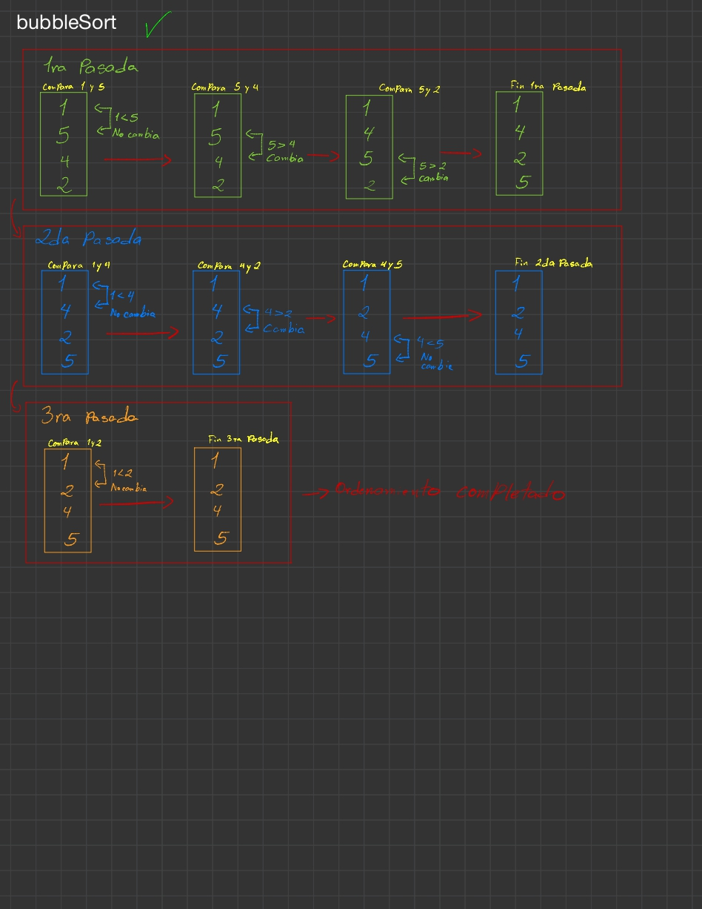

<h2>insertionSort</h2>
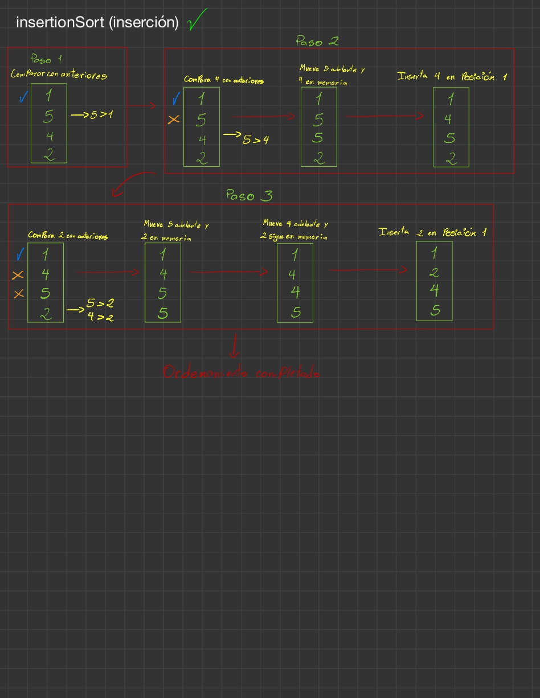

<h2>bucketSort</h2>
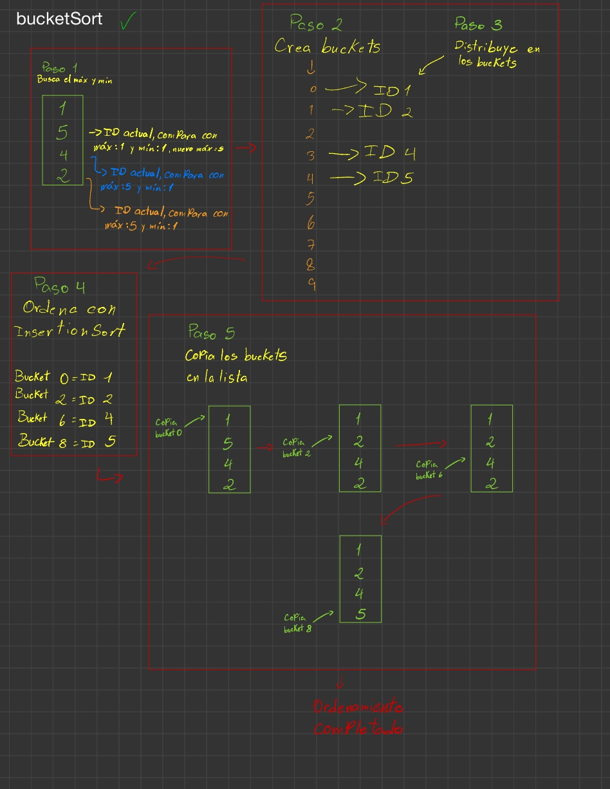

<h2>countingSort</h2>
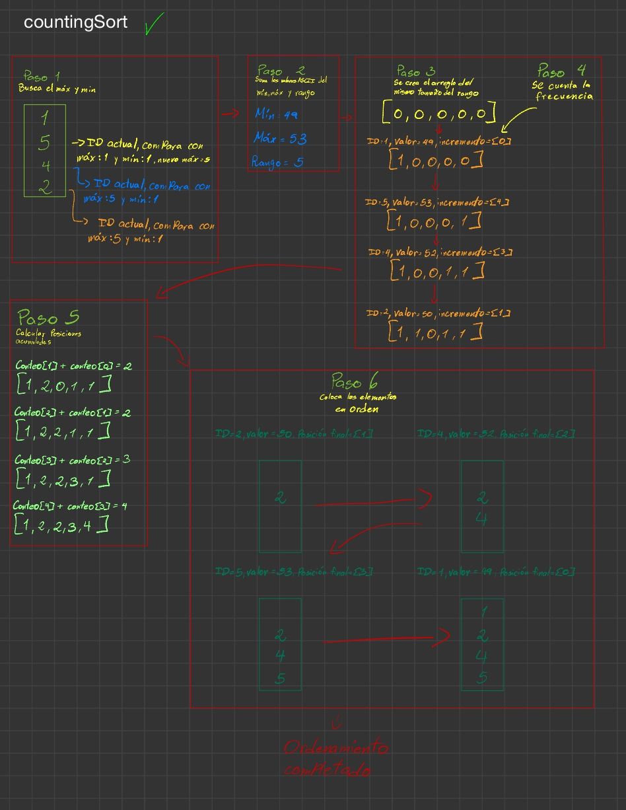

<h2>heapSort</h2>
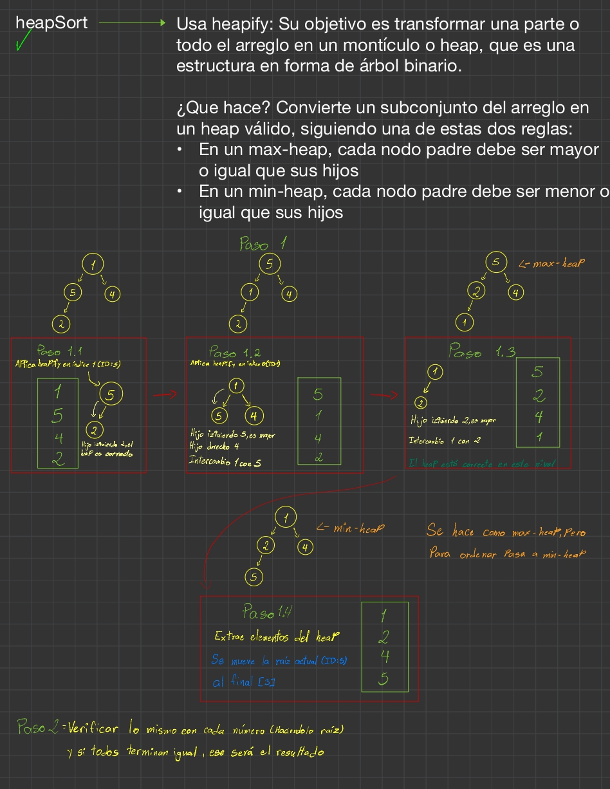

<h2>introSort</h2>
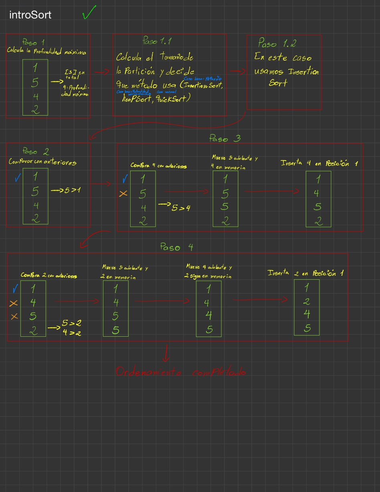

<h2>mergeSort</h2>
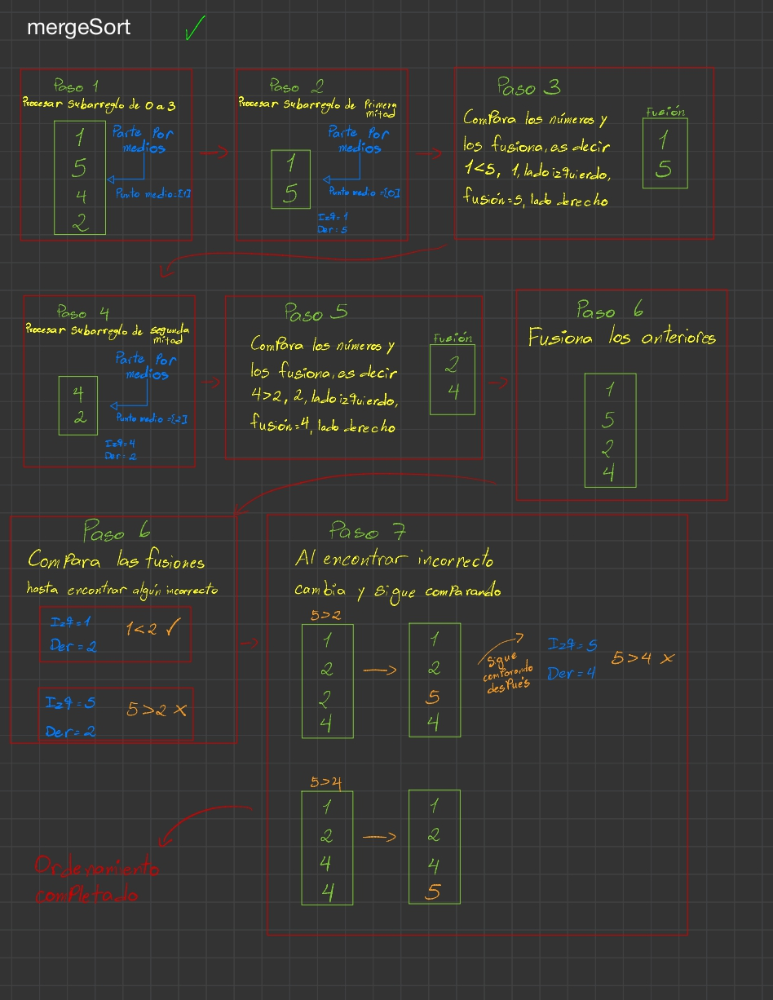

<h2>quickSort</h2>
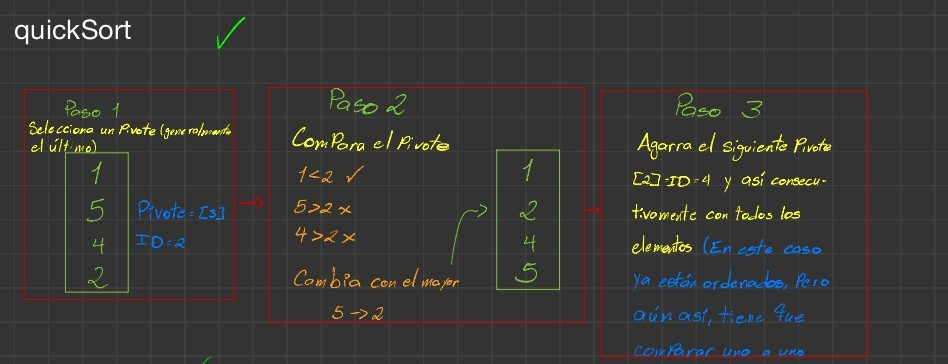

<h2>radixSort</h2>
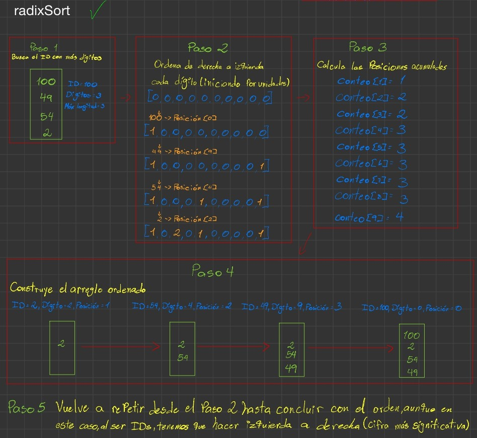

<h2>selectionSort</h2>
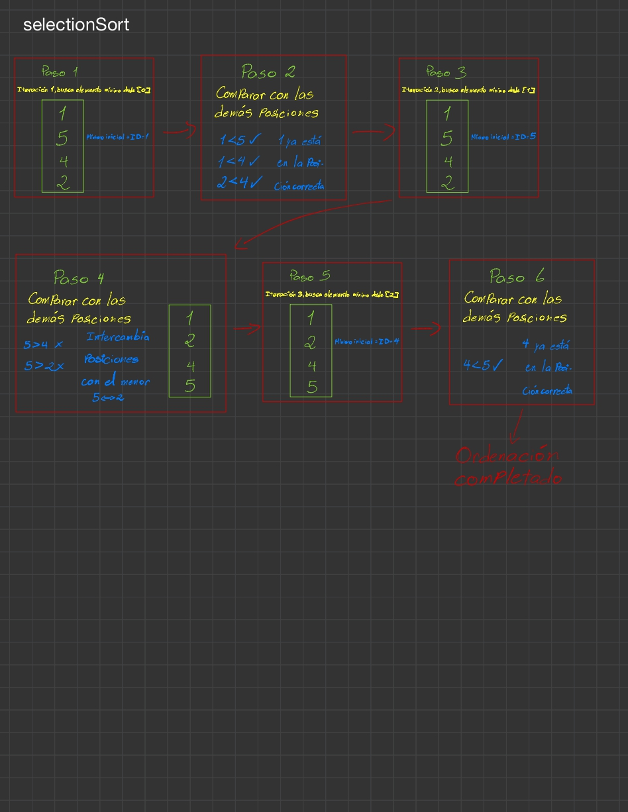

<h2>timSort</h2>
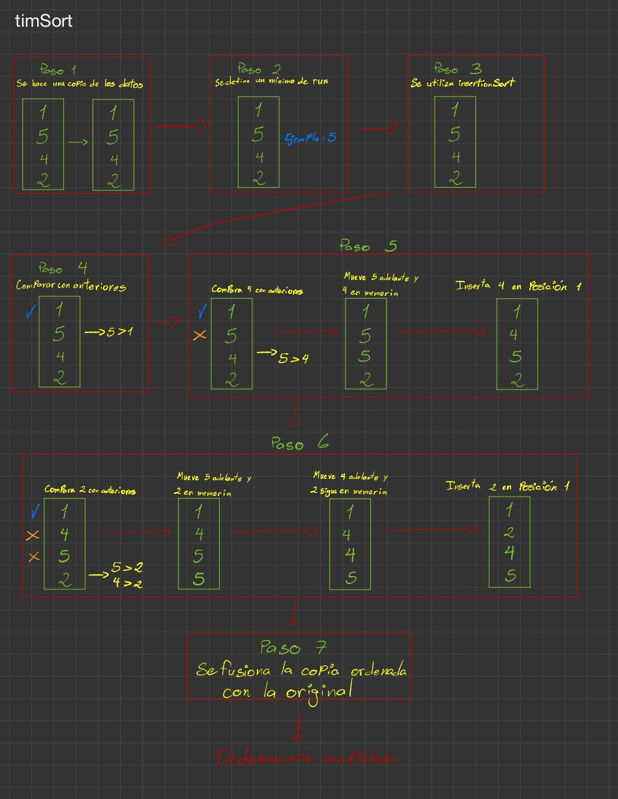

---

### Datos y curiosidades observadas

- **countingSort** al ser muchos elementos lo hace mal por las claves númericas tan dispersas

- **introSort** este metodo funciona en subconjuntos pequeños, al ser demasiados estudiantes, ordena hasta cierto punto bien, luego desordena y vuelve a ordenar

- **radixSort** este método "funciona" pero no de la manera que necesitamos, debido a que los toma en cuenta por así decirlo en unidades, decenas, centenas, etc. Por ende, primero ordena de 0 a 9 las unidades, luego las decenas y así consecutivamente, por ende hace 1010 -> 1020 -> 1030... (con las unidades en 0 y decenas ascendentes), cuando termina con 0, sigue con 1001 -> 1011 -> 1021... (con las unidades en 1 y decenas ascendentes), eso haciendolo de derecha a izquierda, izquierda a derecha es lo preferible para IDs ya que los ordena bien

---

#### Segun las IA's y mi opinion probando el tiempo de los métodos

Le pregunte a las IA's cual es el orden de eficiencia y luego se hace otra tabla con mis resultados.

| #   | Algoritmo (ChatGPT) | #   | Algoritmo (DeepSeek) |
| --- | ------------------- | --- | -------------------- |
| 1   | CountingSort        | 1   | TimSort              |
| 2   | RadixSort           | 2   | QuickSort            |
| 3   | BucketSort          | 3   | MergeSort            |
| 4   | TimSort             | 4   | IntroSort            |
| 5   | IntroSort           | 5   | HeapSort             |
| 6   | MergeSort           | 6   | RadixSort            |
| 7   | QuickSort           | 7   | CountingSort         |
| 8   | HeapSort            | 8   | BucketSort           |
| 9   | InsertionSort       | 9   | InsertionSort        |
| 10  | SelectionSort       | 10  | SelectionSort        |
| 11  | BubbleSort          | 11  | BubbleSort           |

---

- **Según mis propias pruebas**

  _(Los datos están en ms)_

---

| Algoritmo     | P1  | P2  | P3  | P4  | P5  | Promedio |
| ------------- | --- | --- | --- | --- | --- | -------- |
| BubbleSort    | 382 | 471 | 411 | 400 | 406 | 414      |
| InsertionSort | 424 | 323 | 339 | 443 | 339 | 374      |
| BucketSort    | 390 | 458 | 509 | 356 | 472 | 437      |
| CountingSort  | 440 | 302 | 324 | 320 | 322 | 342      |
| HeapSort      | 460 | 409 | 309 | 314 | 328 | 364      |
| IntroSort     | 327 | 324 | 309 | 323 | 326 | 322      |
| MergeSort     | 321 | 327 | 333 | 319 | 336 | 327      |
| QuickSort     | 318 | 352 | 391 | 422 | 488 | 394      |
| RadixSort     | 407 | 421 | 407 | 319 | 435 | 398      |
| SelectionSort | 316 | 414 | 327 | 325 | 337 | 344      |
| TimSort       | 317 | 310 | 306 | 338 | 325 | 319      |

---

**Por ende, teniendo como resultado**:

| #   | Algoritmo     | Promedio |
| --- | ------------- | -------- |
| 1   | TimSort       | 319      |
| 2   | IntroSort     | 322      |
| 3   | MergeSort     | 327      |
| 4   | CountingSort  | 342      |
| 5   | SelectionSort | 344      |
| 6   | HeapSort      | 364      |
| 7   | InsertionSort | 374      |
| 8   | RadixSort     | 398      |
| 9   | QuickSort     | 394      |
| 10  | BubbleSort    | 414      |
| 11  | BucketSort    | 437      |
